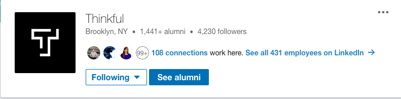
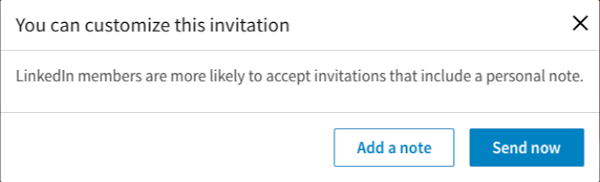

## Overview and Purpose

Cold outreach is an essential part of a successful job search. However, not many people have experience with how to approach cold outreach in a way that gets results. In this checkpoint, you will learn what cold outreach is and how to do it effectively.

## Objectives

At the end of this checkpoint you will:

- Understand cold outreach
- Understand how to find people to contact
- Understand the elements of an effective cold outreach email
- Understand how to apply this to LinkedIn outreach

## Cold Outreach or Networking with Strangers

For many students, networking is one of the scariest parts of the job search. And of all the parts of networking, cold outreach is what many people find the most intimidating. So let’s start to unravel what cold outreach is and how to approach it to take some of the fear factor out of this part of your job search.

*Cold Outreach or Cold Emailing is when you write an email or another type of message to someone that you have no connection with.* 

The goal of this is to get the person interested in you as a potential hire or colleague. It’s important because most of us don’t have a wide network of people who are currently data scientists so we need to meet more. However, like most networking, it’s not effective to simply write “Dear Amy, Please give me a job at your company. Love, Jacqueline”. Nobody likes it when strangers ask them for favors. Cold outreach takes a thoughtful touch to make it effective but, when done well, can lead to impressive results.

**Step 1: Figure Out Who to Reach Out To**

The first thing you need to for cold outreach is to decide who the best person is for outreach. Here’s where your superior Google-Fu or LinkedIn savvy can help. Whenever you find a company that is interesting to you or seems like it would be a good fit, use Google, LinkedIn, the company’s about page, etc to find someone on their Engineering team that either is a hiring manager or that you have a connection with. Here are some quick instructions for finding people who work for a specific company on LinkedIn

First, search for the company name. When it comes up, you’ll have the option to “See all X employees on LinkedIn”

When you click on this link, you’ll see everyone on LinkedIn who has listed this company as their employer. Once you are on this page, you can filter the results based on a number of factors like location, job titles, etc. 

Second, you want to target the **best 1-2 folks** from that company, based on any one of the below criteria:

- **Similar to you already:** Perhaps they themselves graduated from a bootcamp program too? Perhaps you’re from the same university but you never met? Perhaps you find out from their LinkedIn that you’d be great friends because you care about the same topics (based on their profile) anyway? 
  - *These are the ones who are most likely to respond to you fast, and be willingly helpful right away!* 
- **Senior-level:** Think: Who has been in the industry for a while, in this area, and might know a lot of other people who are hiring? 
  - *While response rates on these folks may be 50/50, they are likely to have a strong network of other senior-level folks who you can tap into!* 
- **Seem open to chatting:** You can take a quick scan of a LinkedIn profile and find out two things quickly: 1) Do they check this at all? And 2) Do they seem invested in using it to meet new people too? See if they invite connection requests, or simply paid attention to building out a super fun profile, or recently posted a lot of public posts on their feed.
  - *If they’re open to connecting, they’ll also be open to helping you!* 

**Step 2: Find their Email Address**

Your secret weapons, in this case, are an [email permutator](https://docs.google.com/spreadsheets/d/17URMtNmXfEZEW9oUL_taLpGaqTDcMkA79J8TRw4xnz8/edit#gid=0) and an [email tester](http://mailtester.com/). Email permutators allow you to enter the information that you do know about a person (first name, last name, company) and generates a list of what their email address might be. For many people, it isn’t that hard to guess. Companies aren’t usually that creative about employee emails and it’s often just:

- FirstName.LastName@company.com or 
- FirstInitial.LastName@company.com.

Once you’ve got your list of possible email addresses, use an email tester to find out which of these emails work. 

For more ideas, [check out this blog](https://blog.beamery.com/find-email-addresses/) that highlights multiple tools and ways to do this. 

**Don’t worry if you can’t find an email address for them; you can see below in this checkpoint how to do LinkedIn outreach instead!**

**Step 3: Writing the Email**

Once you’ve identified which person or people you want to reach out to and have their email address in hand, it’s time to craft your email.

Make sure your email follows these key rules:

- It’s brief
- It’s personalized
- It’s targeted
- It’s friendly
- It doesn’t have any typos or errors
- It has a call to action

Here’s how to structure your email:

- **Have a creative subject line** and increase the chances of having your email opened. 
  - [Research on effective subject lines](http://blog.creativelive.com/how-to-write-best-email-subject-lines) *shows that paying attention to this, works!* 
- **Start with a short introduction** of yourself and the purpose for writing the email. 
  - *Think: Why should they keep reading?* 
- **Highlight why you like the company** so much and why you chose this person to email. **
  - *Passion and enthusiasm are great ways to make a positive first impression.* 
- **Demonstrate that this email is personalized** for this person. It’s not something that you’ve copy/pasted to 100 engineering managers.
  - *Do your research and find out a few things about this person that you can mention to show that you really want to talk to them.*
- **Dive into a brief bio on yourself;** the body of your email should give more specifics on your background and why you would be a good fit for the role. 
  - *Keep the whole thing short, don’t go over 3-4 lines. Feel free to attach your resume or link to your portfolio if you have one.*
- **Mention a specific call to action** in the form of a question. Something that prompts a “yes” or a “no” to increase chances of responsiveness - do you want them to grab coffee with you (if they’re local) or hop on a call with you? Do you want them to review your portfolio and share insight? 
  - *Be respectful of your ask, and don’t be demanding here!* 
- **End with a Thank You** so that you show that you respect their time in reading your email. 

Here’s an example:

> [Subject: **Luis, What’s It Like to Work for Vend.ly?**]
> 
> “Hi Luis,
> 
> My name is [NAME] and I’m a new data scientist curious to learn more about the day-to-day at Vend.ly. As a fan of your regular Medium posts, I thought I might reach out to you personally and see if we might able to chat! 
> 
> The first Medium post of yours that caught my eye, was the one where you talked about applying agile work methodologies to the team that you manage, and how effective it is for you on the day-to-day. I especially appreciated your extensive use of gifs throughout, making it a fun read! 
> 
> A bit about me: I’m a data scientist with a background in finance, who is going through a remote online program to build projects in Ruby on Rails. I’m passionate about breaking into a company like Vend.ly, but I understand that I have a lot to learn about this new career, which is why I’m writing to you now. 
> 
> I am curious to find out about what my skills should look like in a real-world setting. I was hoping to hear more about your journey as a data scientist and what you’re working on right now with Vend.ly. 
> 
> Would you be free to grab coffee or connect over the phone next week for 30 mins?
> 
> Thank you, and I hope to chat more soon!
> 
> -[Your name]
> [Github account]
> [Personal email]”

**Step 4: Track Your Efforts and Follow Up**

Make sure to keep track of who you sent a cold outreach email to and when. Keep a Google Sheet or something that works for you - perhaps even set up reminders for yourself one week after you send out an email. 

The truth is, even if you sent one email - the person may need a reminder email simply so that your email can go back to the top of an inbox, and get attention once more. If folks are busy, it is understandable that their inboxes are full and that they can’t pay attention to everything all the time! 

After **one week** has gone by, send another, very short email. This email should acknowledge that the reader is very busy and probably missed your first message. Then reiterate your interest, your background in 1-2 sentences, and the call to action. 

Let the person know that you are flexible about your call to action. If a coffee meeting doesn’t work for them, you are happy to talk over the phone. It’s ok to send two follow-up emails, but don’t send more than that.

**Step 5: Iterate and Test**

In all parts of your job search, you should continuously iterate on your approach. Track the tweaks and changes that you make so that you can measure what’s effective. This approach will help you to improve the results of your search faster and more accurately. 

To learn more about what makes a cold outreach email effective, read about the study that [Fast Company](https://www.fastcompany.com/3036672/what-we-learned-from-sending-1000-cold-emails) did where they sent out 1,000 cold emails to learn what works. Or read [author Adam Grant’s advice](https://www.linkedin.com/pulse/20130624114114-69244073-6-ways-to-get-me-to-email-you-back/) for how to get people to respond to your emails asking for help or favors (he would know has he was profiled in the New York Times as someone who gives great help to strangers and then received thousands of email requests!)

## Effective LinkedIn Cold Outreach

As mentioned above - what if you can’t identify the email address of someone, but you find them on LinkedIn? It’s okay! Just apply the steps above, but with the below information in mind. LinkedIn outreach looks slightly different. 

You research on Linkedin and find a hiring manager, a data scientist  or a recruiter who you **want** to connect with. What next? Well, the good news is, LinkedIn is built for folks like you who want to make new connections! So, just try connecting with them anyway! 

**Step 1: Attempt to Connect With a Personalized Note**

When you attempt to connect with a new contact, there’s a popup that appears with a part that says “Add a note”:

When LinkedIn says that folks are “more likely to accept invitations that include a personal note”, **they mean it**.

Imagine a stranger wants to be your connection and you ask yourself - 1. Do I know this person? And if not, then 2. Why do they want to connect with me? 

You want to be answering that second question, as a new connection, to explain **why** they might want to accept your request. Be brief and don’t pester this person, and actually, LinkedIn has a word limit on this initial message so you have to keep it brief! Just let them know that you would like to connect, that you saw that their team was hiring or that you would like to work there and ask them what it is like.

For example:

> "Hi [Name]! I’d love to connect in order to learn about how your team operates to see if I might be a good fit for the [Data Science/] opening. Any thoughts/insight would be much appreciated; thank you!
> -[Your Name]"

Most people want to help others and if you keep it short and simple, they are more likely to help. The easier you make it for them to respond, the greater likelihood of success. You might find out that you have something in common and they can provide some perspective.

**Step 2: Send a Follow-Up Message After They Connect Back** 

Fast forward to when they accept your connection (yay!), what next? If they accept your connection, you know for a fact that they are online at that time. 

The key here is that you want to be **as prompt as possible** to shooting them another message as soon as they connect! This should be a message that expands on your initial one, add in a little about yourself (a bit of your personal pitch!) and has a call to action.

For example:

> “Hi Luis,
> 
> Thank you for accepting my connection request! As mentioned, I reached out to learn a bit more about Vend.ly and gain insight on the day-to-day life of a data scientist.
> 
> A bit about me: I’m a data scientist a background in finance, who is going through a remote online program to build projects in Ruby on Rails. I’m passionate about breaking into a company like Vend.ly, but I understand that I have a lot to learn about this new career, which is why I’m writing to you now. 
> 
> As you have been working in this industry for a while, I was hoping to hear more about your journey as a data scientist and what you’re working on right now with Vend.ly. 
> 
> Would you be free to grab coffee or connect over the phone next week for 30 mins?
> 
> Thank you, and I hope to chat more soon!
> 
> -[Your name]
> [Github account]
> [Personal email]”

The goal here is to gather information and make a connection. That’s it. 

Avoid reaching out to too many people in one organization - you don’t want to seem like you are spamming them! You want to gather information from the right key players, but you also want to avoid looking like a desperate job seeker.

**Step 3: Follow Up from Your Message**

Similar to what we discussed above for email outreach, you never know how busy someone is on LinkedIn too. As discussed already above, send a quick follow-up note one week after you sent your first message, being brief, respectful and reminding them of your original message! 

## Assignment

- Refer back to your [copy of this doc](https://docs.google.com/document/d/1ttV_YA-HOn2B88e7NFXSVTavVCrJIfVC54b7tK8lOEw/copy) from the last checkpoint. Share that updated link here for the below assignment prompts.
- **Follow-Up from last checkpoint:**
  - Recap the first networking event that you went to. 
- **For this checkpoint:** 
  - Refer back to your Sheet from the Technical Landscape checkpoint. From the 20 jobs you researched, identify three companies you want to connect with for this assignment. 
  - **In the Google Doc**: 
    - Find three people who work for those target companies that are interesting to you. Share the links to their LinkedIn profiles.
    - Attempt to reach out to them either via Email or LinkedIn and share your messages that you used for each person.
      - While you’re at it, why not attempt outreach for all 20 jobs/companies you researched? If so, share your bonus outreach attempts in that doc. 