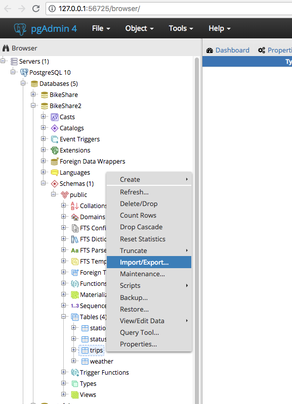
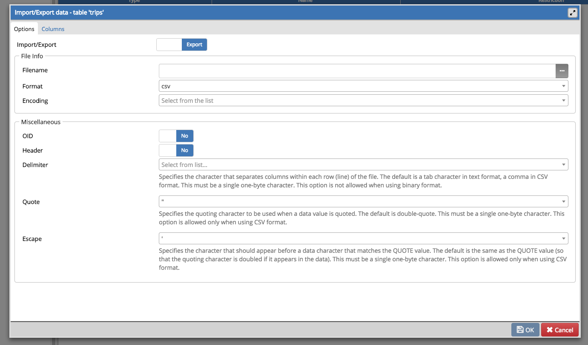

Now that you're comfortable with the Postgres database knowledge, try spinning up your own. Let's use this data set from [Airbnb](http://insideairbnb.com/get-the-data.html). Pick a city and download the CSVs for that city.

Open the CSV file and use the attributes provided on the first line of the CSV to create your table.

When setting up your database, make sure to give your columns reasonable names and don't use any special characters that would throw off PostGres.

When your table is created, you can use the `import` functionality of pgAdmin to load the data into your database.

Once you have your database set up, run some queries to start understanding your city's Airbnbs. Here are some questions you should try to answer:

- What's the most expensive listing? What else can you tell me about the listing?
- What neighborhoods seem to be the most popular?
- What time of year is the cheapest time to go to your city? What about the busiest?

Save your SQL queries in a gist or a GitHub repository and submit a link below.

###### We're working out some kinks on this assignment. We expect to release updates soon, but in the interim, if you have problems importing CSV data for this challenge, please consult [these supplemental instructions](https://docs.google.com/document/d/1F31JGbqORWkR-xCjNqAMg3ibgv6c90giXcU0ruGV8AA/edit).
