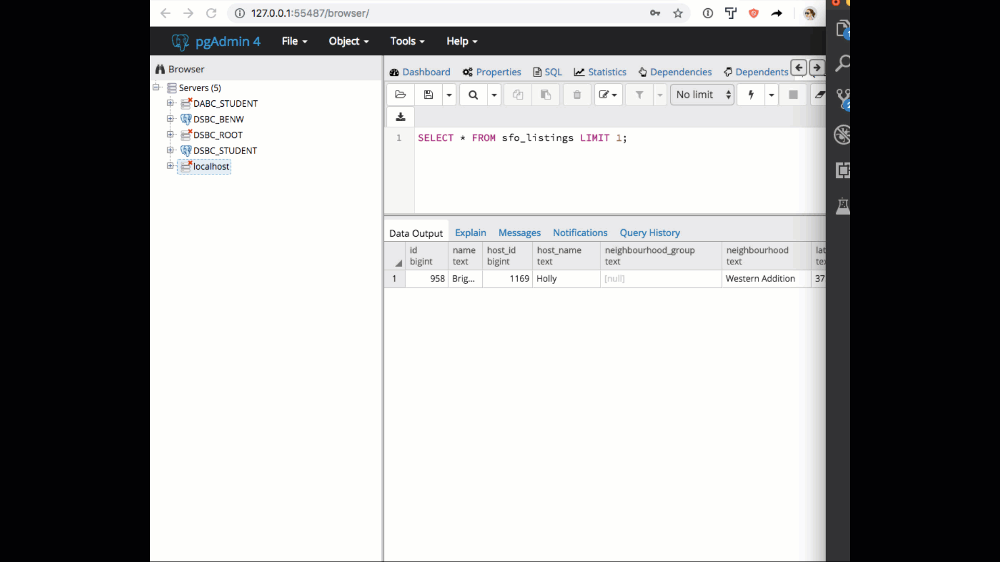

Now that you're comfortable with the Postgres database knowledge, it's time to bring it together in a challenge. You'll connect to a remote database we've set up that contains data from AirBnB about its presence in San Francisco. After exploring how the tables in this database are set up, you'll be asked to answer a short set of questions.

## Connect to remote database server

So far in this module, we've been connecting to a locally hosted database. For this challenge, you'll need to connect to a remote database. The good news is that this is straightforward to do, and after connecting to the DB, everything else will remain the same.

Open pgAdmin, then right-click on the server incon in the top-left corner of the interface. Select *Create -> New Server*, and then name the new server something logical like thinkful_data_science_bootcamp.  

After naming your server, head to the Connection tab. Here you will set a connection to the server using the following credentials:

- Host name/address: 142.93.121.174
- Username: dsbc_student
- Password: 7*.8G9QH21
- Port: 5432

Be sure to check off the "Save password?" option to avoid being prompted to enter your password each time you connect to the server.

Click "Save", and you should see your new server appear in the left part of the interface under "Servers".

Next, click on your new server, then *Databases -> air_bnb_data* (note that there are several databases available on this server, but for now we're only interested in the one with AirBnB data). Then on the air_bnb_data database, click *Schemas -> Tables (3)* to get an initial view of the tables that are available on this database.

## Explore the tables

Spend a few minutes getting up to speed on the database schema. There are three tables: sfo_calendar, sfo_listings, and sfo_reviews. The questions in the next section require you to use all three.

## Questions

Once you have your database set up, run some queries to start understanding San Francisco's Airbnbs. Here are some questions you should try to answer:

 * What's the most expensive listing? What else can you tell me about the listing?
 * What neighborhoods seem to be the most popular?
 * What time of year is the cheapest time to go to San Francisco? What about the busiest?

Save your SQL queries in a Gist or a GitHub repository and submit a link below.