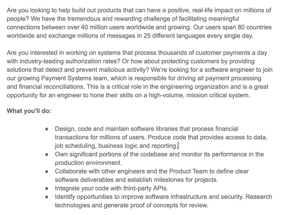
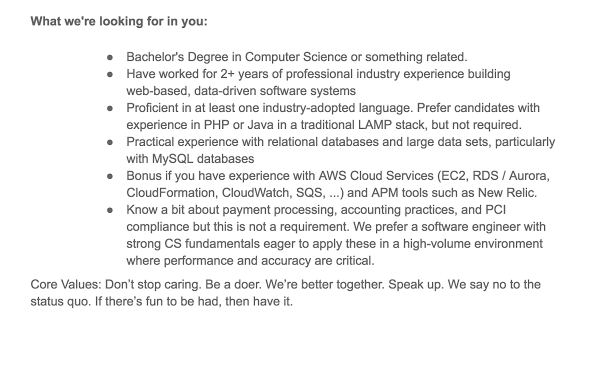
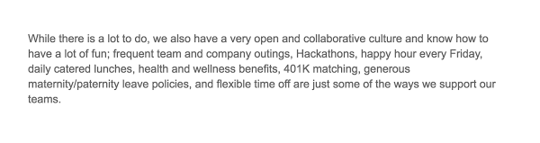

## Overview and Purpose

Job seekers pursue new opportunities in a variety of ways, but a common starting point for the job search is by researching and applying to open positions found online. When they go to find those positions and apply, however, they’re overwhelmed with the types of job titles, descriptions, and postings that float around all over the internet. 

In this section, we’ll go over what companies are expecting from you and how to speak to that. Specifically, we’ll reframe the hiring process and discuss what kind of characteristics employers are looking for during the interview process.

This checkpoint will give you important insight on how to focus as well as research and pursue the right opportunities.

## Objectives

At the end of this checkpoint, you will:

- Understand how to analyze job listings
- Set goals and find positions that meet your needs
- Be able to read a job posting
- Determine if a job posting would likely be a good fit
- Identify key traits that hiring managers look for while interviewing

## Why You Are Being Hired

- The most important thing to understand is that someone is hiring you because they can make more money or save more time by hiring you. Internalizing this simple fact will hopefully help you to see past the - sometimes fluff part - of a job description and to the pain that someone in that organization is feeling that they believe will be solved by you.
- Hiring managers are busy people and, based on prior experience, they generally have a pretty good idea of what a "good developer" looks like. They generally don't spend too much of their valuable time worrying about how to seek out good candidates who might not fit their profile because that takes too much effort. They just want to get back to building stuff and not have to hire again anytime soon.
  

**So what is the profile of a "good" candidate?**

Let's look at this from the perspective of a hiring manager. The hiring manager is looking for someone who can:
                                                                                                                   
1. Write clean and effective code
2. Work well with other members of the team
3. Present well to clients (if it's a client-facing role

Plus, *Can you add value immediately and grow fast enough to keep up with the team?*

Hiring managers generally determine these things by looking for the following characteristics in applicants:

1. **Intelligence** to take on challenging problems and not be broken by them.
2. **Curiosity** to constantly learn more and grow skills.
3. **A Hacker Mindset** to solve tough problems in innovative ways.
4. **Passion** for development, which drives both work ethic and curiosity for new knowledge.
5. **Deep Technical Knowledge**, ideally but not necessarily in the relevant technology stack.
6. **Good Communication** with other team members.
7. **Genuine Passion** for both development and the company's specific mission.
  
They tend to try and identify these characteristics in applicants by using the following markers (whether you believe that should be the case or not):

1. **Relevant prior work history.** It sure helps if you've done the job already! It means someone else has already gone through the hard part of training you in professional workflows and how to work in that kind of environment.
2. **Relevant school experience** (a CS degree, for example), especially from a good school. Again, it means that someone else has decided you're "smart enough" to admit to their school and that you've persevered through 4 challenging years of studies.
3. **Relevant side and open source project experience**, especially with the technologies that are most relevant and at a production scale which would mimic the real work environment. Projects are particularly interesting when they are side projects because it indicates that the developer is passionate enough about learning and building that they will do so on their own time. That sounds a lot like "free training" for that person as an employee!
4. **Ability to code live**, especially in interviews. There's no substitute for actually coding.
5. **Ability to solve challenging conceptual problems**, especially technical problems in interviews. These are used both as an intelligence test ("can you figure it out???") and as a test of your previous education ("you really should have seen problems like this before if you'd had a degree in XYZ").
6. **Ability to answer trivia questions about languages and development practices**, especially any languages you claim to know well. This is a test of your previous education (was it just surface-level or did it actually cover true fundamentals?) and of your tendency to constantly seek greater learning (because you learn most trivia simply by being curious about how languages or systems work and discovering it on your own).
7. **Smooth and "normal" communication with team members and interviewers**. A lot of people are quirky, but if you can't communicate with the team, you aren't as useful as a less talented developer who can.

**Here are some things you’ll likely see**

- **Years of experience.** Most of our graduates end up in the 2-4 and 3-5 year roles so do not take these ‘required years’ too literally.
- **Degree requirements.** Again, unless the posting explicitly says something like boot camp grads should not apply, everything else is fair game. For example, more and more we’re starting to see “Computer Science degree or equivalent,” which can come in many shapes and forms.
- **Technologies**. Don’t expect to be a perfect match for every role nor should you solely apply to what’s a 100% profile match. As a general rule, if you can use 50% of the technologies that they use, go for it. We’ve seen students with no experience in Ruby on Rails end up in an entirely RoR role.

Now that you have more background on this, let’s put it to work!

## How to read a job post and description

Below is a sample job posting. They can look intimidating at first but there’s no reason you can’t apply! Check it out below. It is broken down into a few sections for review.

You’ll see in the above screenshot that it sounds like a really interesting position. So far we see that the new employee will impact many users and will be able to contribute to big projects. So far so good.

Now, this is where you need to focus. We’ll go point by point and will be using web development as an example. However, the reasoning behind it is applicable to all programs.
    
- **Bachelor’s Degree in Computer Science or something related.**
  Again, you’ll see that employers will say that you need a degree in Computer Science. While this is great, it is often considered a nice to have. The employer usually cares more about a candidate that can get the job done on a day-to-day basis.
    
- **2+ years of professional industry experience...**
  This is where you can really shine. What they usually mean here is, “We want someone with experience building apps; someone that has seen code and is willing to jump right in.” Our programs are designed to condense your learning time and maximize your experience while you are working through your track. Don’t let this prevent you from applying.
    
- **Proficient in at least one industry-adopted language**
  Awesome! Through our program you learn so much more and it’s truly designed to make you a well-rounded developer. When certain languages are mentioned, feel free to do a little research and find out what that language is all about. In the event of an interview, you can better speak to the needs of the company when you are a little familiar with their current tech stack. For example, PHP is very popular and used by many companies. With a quick online search, you can find that Wordpress is the major reason for its popularity. You could mention this point in an interview.
    
- **Practical experience with relational databases**
  SQL reads a lot like English. With a little bit of practice, you should be all set.
    
- **Bonus if you have experience with...**
  If you don’t have experience in this area. That’s okay! Just be sure that when you interview, you have an idea of what it is and what it can do for the company. Let them see that you did your research.
    
- **Know a bit about payment processing...eager to apply these in a high-volume environment where performance and accuracy are critical**
  Play this to your advantage. If you have any experience with banking or financial portions of a company, play that up. Mention this in your resume and customize your position details to let them know how your prior experience would help you in this position. If you don’t have any idea about this area, let them know that you are eager to jump in and learn about financial transactions and you understand the importance of accuracy in this role.

Lastly, this looks like a fun team and company to work with. They seem to celebrate education and their employees all while enjoying the time spent as a team. They talk about Hackathons. This is a great way to collaborate in a new way with your team and change up the pace of the day-to-day job. Everything in this job posting says, why not apply?

## How do I know if this job will be a good fit?

Honestly, you don’t always know. But there are signs to watch for to make sure that you are applying to jobs where you qualify and where you could see yourself for at least six months or longer. Ask yourself the questions below when considering positions.

- **What**
  What is involved in this position? Do I meet 40-50% of the requirements? Honestly, that's really all you need to feel comfortable applying. Many people make the mistake of thinking they need to meet every single qualification to get a job and this just isn't true. [**Women and other underrepresented groups in tech are especially prone to this kind of thinking**](https://hbr.org/2014/08/why-women-dont-apply-for-jobs-unless-theyre-100-qualified).

- **Where**
  Where is this position? Would it be a long drive or commute? If so, be sure to plan ways to make the commute more tolerable such as podcasts, a great playlist or an audiobook. Could I see myself there long-term?

- **When**
  When are they looking to hire? When was the job posted? If the job was posted more than a few weeks ago, be sure to do additional research. See if you can find the position in other places online such as the company website, LinkedIn, or Twitter. Companies often forget to take down postings after they have already hired so be sure to do your research as needed.

- **How**
  How would I fit into this role? Do I know the language or could I transition and learn while on the job? Do they support education and will they help you grow and learn as a developer?

- **Day-to-day activities**
  What would your day-to-day life look like at this company? Would you be supported in this role? Would you get to pair program regularly with another team member? Is this important to you? Determine what is important to you in a role before looking at different positions and keep your eye out for those that meet most of what you are looking for.

## Next Steps

**Step 1:** Review different job boards and choose at least 3 open roles.

**Step 2:** Analyze the job listings as we did above. 
  Do you meet at least 50% of the technical requirements? Could you thrive in their day-to-day responsibilities? 

 
## Assignment

Choose three relevant job listings and discuss why or why you aren’t a good fit for them via this [worksheet](https://docs.google.com/document/d/1S1C1uYmsbIidtkjC-BrDTnAKrTzmS-BrXCuw250NMyw/edit). 

