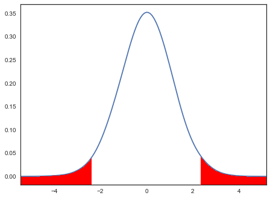

## P-value Limbo: How Low Can You Go?

At a few points in this program you've seen brief mentions of "p-values", where "p" stands for probability. Statistical tests tend to be evaluated by the p-values they return. ven some laypeople know this general rule: A p-value less than .05 is good, and a p-value greater than .05 is bad. 

In actuality, p-values are the culmination of **null hypothesis testing**, the most common system used to test provisional beliefs about data. In null hypothesis testing, the tester has a hypothesis that describes what they think their data will look like if their expectations are confirmed. Based on that hypothesis, they also define a null hypothesis, which describes what their data will look like if their expectations are not confirmed. Some examples of hypotheses and null hypotheses:

_EXAMPLE 1_
* **Hypothesis**: People who whistle will be happier than people who do not whistle.
* **Null**: There will be no difference in happiness between people who whistle and people who do not.

_EXAMPLE 2_
* **Hypothesis**: There is intelligent life on other planets.
* **Null**: There is no intelligent life on other planets.

Data is then compared to the null hypothesis. When evaluating two groups in a t-test, for example, the size of the difference between the two groups is divided by the combined variance of the groups. This ratio, known as a t-value, is then situated within a t-distribution (very similar to the normal distribution, but with thicker tails) that represents the t-values you would get if the null hypothesis were true. 

The farther from the center the calculated t-value, the less likely it is that the null hypothesis is true. The area under the curve of the t-distribution is equal to one, and the total area defined by our t-value sums to the p-value. For example, with a t-value of 2.3 in a sample of 21 people, the t-distribution looks like this:

The sum of the red area under the curve is .032347, also known as the p-value. The p-value represents the probability of getting a t-value that large or larger if the null hypothesis is true. 

## "The Earth is Round, p < .05"

A useful decision-making rule for p-values is that anything less than .05 means we reject the null hypothesis of no effect. Typically people take that to mean that their hypothesis is correct. The .05 threshold is used because, in theory, it would return a false positive (evidence to reject the null hypothesis when in fact there is no effect) for 1 in 20 tests and happens to correspond to two standard deviations, or [two sigma](https://en.wikipedia.org/wiki/68%E2%80%9395%E2%80%9399.7_rule). While the choice of a .05 threshold is somewhat arbitrary, it is the default assumption for most data scientists. Some fields, such as neuroscience and genetics, use much lower thresholds, down to p < .000001. And then there's high energy physics, which places the "discovery" of a new particle at [p < 0.0000003 or five sigma](https://blogs.scientificamerican.com/observations/five-sigmawhats-that/).

---
type: written content
time: 20 minutes
name: T-tests and Philosophy of NHST
author: Bethany Kok

---

## T-values
In the example from the previous assignment we derived p-values from t-values, taking both tails of the t-distribution.

Why look at both the positive and negative t-value?  The default t-test is "two-tailed", meaning it tests the likelihood of getting a value "more extreme" than the t-value in either direction.  If there is no possibility of getting a negative t-value, then you can use a "one-tailed" p-value which means the p-value is calculated by summing the area under the curve of only _one_ of the two tails.  A one-tailed test would be appropriate, for example, when comparing an average weight to zero.  For the t-value to be negative, the average weight would have to be negative, which is obviously impossible.  Typically, the two-tailed t-test is used, under the assumption that it is better to be too conservative (get higher p-values than we should) than too liberal (get lower p-values than we should).

## Philosophy of Null Hypothesis Significance Testing

The typical interpretation of p-values ("less than .05 means my hypothesis was right, yay!") works fairly well in practical terms. However, it's important to know that interpretation is _wrong_.  The p-value represents the probability of getting the data you have _if the null hypothesis were true_ in the population. The null hypothesis is typically a no-effect hypothesis.  That means that when the p-value is less than .05, there is a less than 5% chance of getting your particular data by random chance even though there was no effect in the population. This leads us to _reject the null hypothesis_ of no effect.

Note that there is no mention of the _actual hypothesis_ ("there is an effect and it is X") anywhere in there.  The entire edifice of **null hypothesis significance testing** that culminates in p-values is almost completely agnostic to the content of your actual hypotheses.  All NHST allows the data scientist to do is to conclude that there is probably not _no effect_.  In the universe of NHST the actual effect, if it exists, could be anything at all.

Happily, our actual hypothesis does come into play in another way.  The purpose of an experiment, such as an A/B test, is to create a situation where there are _only two possible outcomes_: if your hypothesis is correct, outcome X will occur, while if the null hypothesis is correct, outcome X will not occur.  If the possibility space is indeed limited to only those two potential outcomes, then rejecting the null hypothesis (outcome X did not not occur) may be considered tantamount to accepting the hypothesis (outcome X occurred).

However, you can never truly limit the possibility space to just two outcomes. It is impossible to prove that _only_ our hypothesis could have led to outcome X, no matter how well we set up the experiment, and that the effect wasn't due to some _other_ cause we didn't account for. We can _disprove_ a hypothesis, as is hopefully the case with your null hypothesis, but we can never definitively _prove_ a hypothesis correct. We can only add _support_ for our hypotheses by disproving others; ruling out the null hypothesis and as many other hypotheses as we can practically manage. If you'd like an in-depth further philosophical discussion on this topic, see [Underdetermination of Scientific Theory](https://plato.stanford.edu/entries/scientific-underdetermination/) in the Stanford Encyclopedia of Philosophy.

