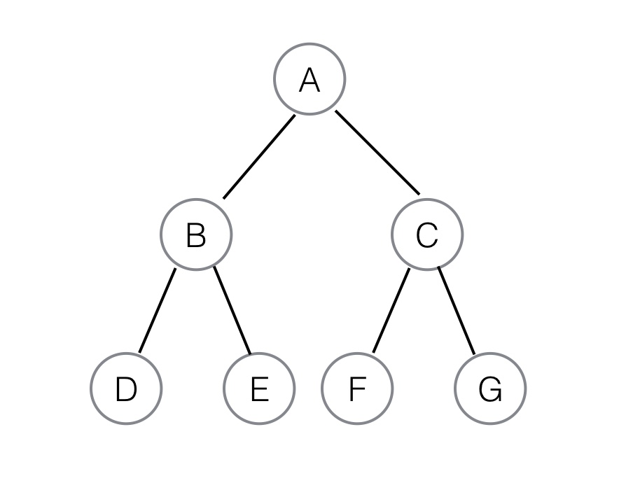

The last data structure we’ll cover in this lesson is the tree. Trees are a bit different than the data structures we’ve seen thus far, but present a useful way for storing information that has either a hierarchical structure or that needs to be rapidly searchable. The most distinguishing trait of trees, however, is their sheer flexibility. We’ll explain what we mean below.

## What is a tree?

Here we’re going to focus on the most common variety of tree, the binary tree. We'll use that example to go over the vocabulary of trees.

All trees are a set of nodes connected in a hierarchy. Each _node_ is a value. That node can connect to nodes below it, which are called its _children_. The node linked above it, should it exist, is called a parent. The top node is called the _root_. If the node has no children it’s called a _leaf_. Every tree is a combination or permutation of these elements.

Let’s look at a simple tree and review those definitions, because they’ll be relatively fundamental to what’s to follow and we’ll rely on them whenever we talk about trees. Also, while they’re similar to how we’ve talked about decision trees as a model, we cannot conflate the two as the terms will vary and have sometimes subtle differences in meaning.



So, here A is our root. B and C are children of A. A is therefore a parent of B and a parent of C.  B, in turn, is a parent of D and E, while C is a parent of F and G. D, E, F, and G are our leaves.

A tree is binary if each non-leaf node has no more than two children. A tree where all parent nodes have two children, like the one above, is called a full binary tree (the leaves don't all have to be in pairs and it can still be binary). This can even more specifically be called a perfect binary tree, since it is a complete tree with all leaves on the same level.

## A simple python implementation

So how do we make a binary tree of our own?

We can do it in two steps. First we must create a node class.

```
class Node:
	def __init__(self, val):
		self.left = None
		self.right = None
		self.val = val
```

What this has done is create the framework for nodes. A node will take a value, which gives us the value at that point. It also lets us establish a left and right value, the two children of this node. To create a binary tree, we simply populate those children with their own nodes.

So to reconstruct the tree from above we’d simply do this:

```python
# Establish the initial root node and children
root = Node(‘A’)
root.left = Node(‘B’)
root.right = Node(‘C’)

# Add the appropriate children for ‘B’ and ‘C’
root.left.left = Node(‘D’)
root.left.right = Node(‘E’)
root.right.left = Node(‘F’)
root.right.right = Node(‘G’)
```

And there you have it. We’ve now successfully implemented our example tree in Python. Note that this tree can easily grow by adding further children to leaf nodes, an important feature of trees that can be valuable if you need your tree to dynamically grow and prune.

## Flexibility and Use Cases

Now, one of the main features of trees as a data structure should be clear here. For arrays and linked lists there was a pretty clear order to things, and that order was very clearly specified in building the list. That order also meant a rigidity.

Trees, however, are much more flexible. You can put data into them in a variety of different ways, leading to a variety of differently shaped trees. Trees can have three children per node. They could increase as you move down from node to children. They could do almost anything you could imagine in that structure of nodes and children. Now, naturally, some will be more suited to certain data sets than others, and efficiencies of various operations will likewise vary, but the sheer flexibility is a key advantage.

So what are these kinds of trees good for? The most obvious answer is hierarchical data. If you think of your data in layers, then trees can represent that. Academic courses (broken down into department, level, and then course) are a classic example. Machine learning models (broken down as supervised/unsupervised, then by class, then down to specific kinds of implementations) could also work.

## Traversing a Tree

Traversing a tree means seeing the value of all of the nodes in a trees and discerning its structure. If you are simply given a tree you have to traverse it to know what its structure is and values are. This is another point where trees offer serious flexibility and a great deal of choice for the user. For an array or a linked list, there is a single way to best read the data (though you could argue arrays could also be read backwards). Trees have many many more options.

The simplest way is probably _breadth first_. In breadth first you try to explore the full breadth of a layer, one layer at a time starting from the root. For our example this would look like:

A, B, C, D, E, F, G

You tend to favor starting on the left for all traversal algorithms.

You can also read a tree in a preorder fashion. This moves all the way through the left side of the tree and then moves back one layer at a time to move to the right before then proceeding down the left side of the tree. To further explain, this would read our tree as:

A, B, D, E, C, F, G

This is called a depth first traversal, since it first aims to find the depth of a tree, in direct contrast to the breadth first method outlined previously.

## Binary Heaps

Binary Heaps are a particular variety of binary tree. They have two defining features. Firstly, the must be complete binary trees. Second the values within the heap either always increase or always decrease as you move from layer to layer. This means every parent must either be greater or less than all children (this property must hold for the whole tree). A minimum binary heap sees the parent as always less than the children, a maximum always greater than.

Let’s look at an example.


Here we have a maximum binary heap. Each parent is greater than its subsequent children. Now, obviously, to have this greater than or less than property the heap has to be used to store numeric data.

Why do this? Well, this gives us some advantages in searching for data. For instance, when we look to the second layer, we know the only place an 8 could be is as the child of a 9. We gain that information without having to look through the children of 7. Data scientists will want to use this for times when they want quickly find and use subsets of a data set, so the tree will need to have the logic the data scientist can use.

You can see a broader Python implementation of the binary heap [here](http://quiz.geeksforgeeks.org/binary-heap/).

DRILL:

Implement a binary tree, which is filled with 15 pieces of random data. Your job is to then write a program to traverse the tree using a breadth first traversal. If you want additional practice, try other forms of traversal.

