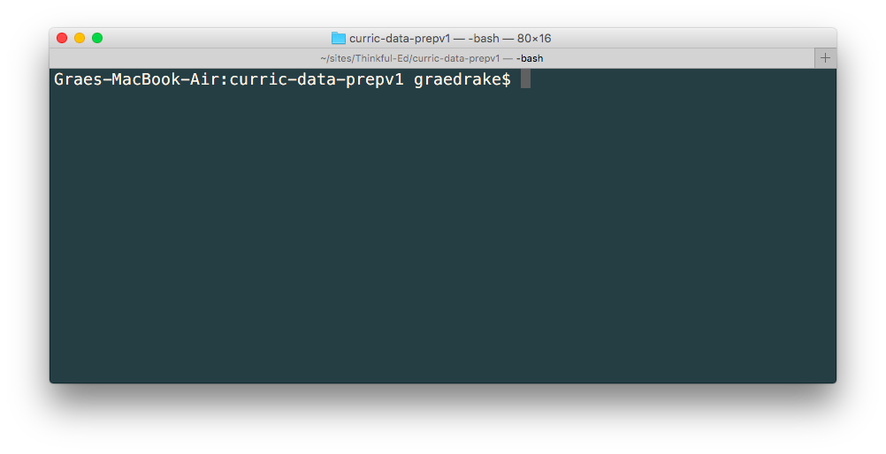

So far you've been working with remote Python environments like Trinket, Codewars, and perhaps web-hosted Jupyter notebooks, where the Python code you write is sent to another machine, executed remotely, and the results are sent back to your web browser.

In this checkpoint, we'll set up your local development environment with an up-to-date install of Python and related tools.

Configuring your development environment can be as easy as following a few simple directions, or it can involve running down and solving subtle bugs and configuration issues. It's impossible to write instructions for every combination of operating system and preexisting environment configuration. The directions in this lesson should cover most use cases, but don't be discouraged if you need to change things up.

This is an _excellent_ topic to hit with your mentor if you run into trouble. In addition, **don't let yourself get roadblocked** by your local environment for too long. You'll need to have your local environment working for your capstone project in Unit 4, but you should be able to continue working into Unit 2 and Unit 3 on the remote environments you've seen so far. If necessary, seek help from your mentor, group sessions, or [Slack](https://thinkful.slack.com/messages/data-science/), then continue on and circle back here later.

We'll start off by installing Python 3. Below are instructions for installing on Mac and Windows systems. If you're running Linux we'll trust you to use your distribution's package manager for everything.

### Installing Python 3 on a Mac.

If you have a mac you almost certainly have Python 2 pre-installed on your machine. You can check your version of Python by opening your terminal and running the command:

```sh
$ python --version
```

If that returns Python 3.5 or higher, congratulations! You're all set up and ready to begin installing modules. You can move on to the next assignment.

###### The code sample above represents the command line in your terminal. It's customary to use the <code>$</code> symbol to represent the full command line prompt, even though your full command line prompt may be much longer. For example, the command line prompt in the screenshot below includes the host name, working directory, and user. In code snippets we ignore all that and represent the full prompt with just <code>$</code>.



In the more likely event you have Python 2.x installed we're going to install Python 3 as well. When you're done you'll have access to both versions.

There are a number of ways to install Python. We're going to use Homebrew: the official unofficial package manager for Mac OS. Homebrew is almost universally used by professional developers on Macs, so having it now will be handy down the line.

Just as we checked first whether we had Python 3 installed, go ahead and check to see if you have Homebrew installed:

```sh
$ brew
```
If you see something like `-bash: brew: command not found` then you don't have it yet. Otherwise you have it installed! Make sure you're up to date and run:

```sh
$ brew update
```

Before you can install Homebrew and Python you'll need a recent install of Xcode and the XCode Command Line Tools from Apple. The process for checking whether you already have this depends on your Mac OS version. Check your version and follow the instructions on this [Stack Overflow question](http://stackoverflow.com/questions/15371925/how-to-check-if-command-line-tools-is-installed) to check whether you already have it installed.

If you don't have the XCode Command Line Tools installed, head to the [XCode page](https://developer.apple.com/xcode/) to download and install XCode. Finally, install the XCode Command Line Tools by running this command in your terminal:

```sh
$ xcode-select --install
```

With XCode and its command line tools installed we're ready to install Homebrew. Head to [brew.sh](http://brew.sh/) and paste the one-line installation command into your terminal and hit return. As of writing this command is:

```sh
$ /usr/bin/ruby -e "$(curl -fsSL https://raw.githubusercontent.com/Homebrew/install/master/install)"
```

Confirm that the install worked with:

```sh
$ brew update
```

With Homebrew installed you're ready to install Python 3 with this command:

```sh
$ brew install python3
```

This will install Python 3 and allow you to run the interactive Python interpreter with the command `$ python3`. The command `$ python` will probably still point to your preinstalled Python 2.x. Confirm that the install worked with:

```sh
$ python3 --version
```

That should give you something like `Python 3.6.2` if the install was successful. Congrats!

If you run into trouble here or get stuck, seek help from your mentor, group sessions, or [Slack](https://thinkful.slack.com/messages/data-science/). Don't spend more than an hour running down issues on your own. If you aren't able to get Python 3 installed right now continue on to Unit 2 and circle back to this during your next session with your mentor. As a last resort if you and your mentor agree it's best for your system you can install Anaconda (intentionally not linked), which will get Python 3 and the packages we cover later on your system, but which is not as good a long-term option as setting up and using Homebrew.

## Windows

If you're on a Windows machine we're going to install Python 3 directly from [Python.org's download page](https://www.python.org/downloads/). The recommended version is the most recent stable version, which as of this writing is 3.6.2. For Windows-specific install notes, see the Python docs on [using Python on Windows](https://docs.python.org/3/using/windows.html). You **do** want to choose the "Add Python 3.x to PATH" option.

You'll also want a good shell to work with. Depending on your OS version you probably have PowerShell. See if you do and if so what version you have, then head to the [PowerShell GitHub repo](https://github.com/PowerShell/PowerShell#-powershell) and download and install the most recent version if you need it.


When you installed Python 3 you also got **pip**, the [package manager for Python](https://en.wikipedia.org/wiki/Pip_%28package_manager%29), for free. You'll use pip frequently in your career to download and manage Python tools.

###### If you somehow didn't install Python 3 or your Python 3 version is lower than 3.4 you may not have pip. You can install it manually with <a href="http://stackoverflow.com/a/12476379">these instructions</a>, but you're better off just installing the most recent version of Python.

These instructions should work across Mac, Windows, and Linux platforms.

Let's confirm your install:

```sh
$ pip --version
pip 9.0.1 from /usr/local/lib/python3.6/site-packages (python 3.6)
```

If that gave you an error you don't have pip installed. Your path and versions may look slightly different. The important thing is that your Python version is at least 3.5. If instead that shows Python 2 then you may have the Python 3 version on your system as `pip3`. Try `$ pip3 --version`. If that worked then replace all the examples of `pip` with `pip3` in the coming material.

Before moving on make sure you have the most recent version of pip by running:

```sh
$ python -m pip install -U pip
```

###### The instructions that follow use <code>python</code> and <code>pip</code> for consistency instead of <code>python3</code> or <code>pip3</code>. Replace <code>python</code> with <code>python3</code> and <code>pip</code> with <code>pip3</code> if appropriate for your system.

## NumPy

NumPy is the fundamental scientific computing package. Most other Python data science tools are built on top of NumPy and treat it as a dependency. You should be able to install NumPy with:

```sh
$ python -m pip install numpy
```

Numpy is big and may take a while to install. As of mid 2016 NumPy should also install successfully on Windows machines with the above command. Confirm your successful install by running `pip freeze` at your command prompt. This will list out all of the Python packages you've installed and should include NumPy.


## Pandas

Pandas is _the_ Python library for data manipulation. It gives you custom objects (particularly the data frame) that you'll use every day.

```sh
$ python -m pip install pandas
```

Run `pip freeze` to confirm your install.


## Matplotlib

Matplotlib is the 2D plotting library you'll use to produce many of your visualizations. You'll use it both for data exploration and for presentation.

```sh
python -m pip install matplotlib
```

Confirm your install with `pip freeze`.


## SciPy

SciPy adds algorithms, convenience functions, and is the basis for many other packages you'll install in the future.

```sh
python -m pip install scipy
```

Brrr, it's getting cold in here from all this `pip freeze`.


## Install Jupyter Notebooks

Jupyter notebooks allow you to write, execute, and visualize Python interactively. You'll use Jupyter notebooks as your primary IDE for writing Python in the bootcamp.

```sh
python -m pip install jupyter
```

One last `pip freeze` for good measure.

To use Jupyter notebooks, run `$ jupyter notebook` from your command line. This will start the Jupyter server and open a browser tab that hits the server. You can kill the server by closing the terminal window it's running in or with `control` + `c` on a mac. If you close your browser but the server's still running you can open a new tab to the server at the address listed in your terminal that starts with `http://localhost:8888/?token=`.

Congratulations on getting this all set up. Time to start using this stuff!


<jupyter height="1000" notebook-name="1.7.3_jupyter_notebooks" course-code="DATA-201-PREP" />
