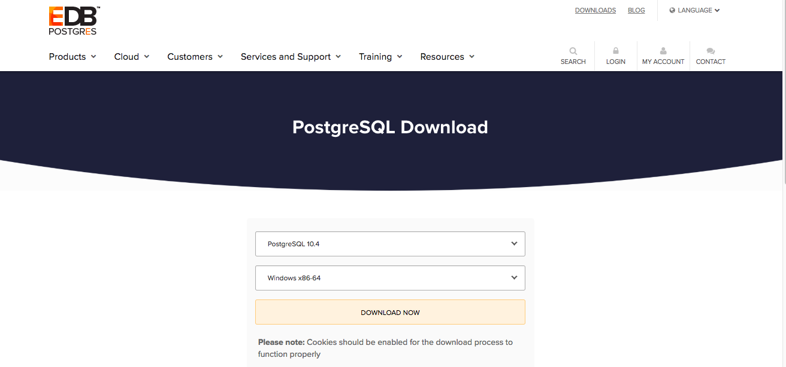

In this checkpoint, you will learn how to locally install and configure Postgres. We provide instructions for Mac and Windows. 

## Mac setup

* Go to [the Postgres download site](https://www.postgresql.org/download/macosx/) and click `Download the installer` for EnterpriseDB.
* Select the most recent stable release (which should be the topmost one) for MacOS.


* After downloading, find the `.dmg` file on your local machine and double click it to run it. 
* Choose the default options when the installer runs.
* You'll be asked to provide a password for the Postgres user, which is the default superuser for Postgres (i.e., the user who has all admin privileges for the database). 
* Be sure to make a note of the password you choose, as you'll need it later. 
* It may take a minute or two for the installation to complete.
* When it does complete, you may be asked to run `StackBuilder` to download and install additional tools. Choose **No**.
* Once the installation is complete, open spotlight on your Mac and find `pgAdmin`. pgAdmin is the graphical interface for Postgres, and it comes with your Postgres installation.
* pgAdmin will open in a browser on the Mac as follows: 


 


## Windows setup

* Go to [the Postgres download site](https://www.postgresql.org/download/windows/) and click `Download the installer` for EnterpriseDB.
* From the installer options, select the most recent version and `Windows x86-64` for operating system.



* After it downloads, double-click on the installer in your download folder.
* Choose the default options when the installer runs.
* You'll be asked to provide a password for the Postgres user, which is the default superuser for Postgres (i.e., the user who has all admin privileges for the database).
* Be sure to make a note of the password you choose, as you'll need it later. 
* It may take a minute or two for the installation to complete.
* When it does complete, you may be asked to run `StackBuilder` to download and install additional tools. Choose **No**.
* Once the installation is complete, go to your start menu, you should see pgAdmin Icon. It is the graphical interface for Postgres. Click to open the application.

## Create a database with pgAdmin

* On the left side of the `pgAdmin` dashboard, if you click on the `Servers`, it will ask you for a password. Use the password you created when you were installing Postgres.
* Once you type in your password, you will see that it shows you all the information about your databases. If you click on `PostgreSQL` under servers, it shows you the databases that you have. You can see that a database called by `postgres` is already created there for you.
* Let's create a database and load some data into the database. We will use pagAdmin's interface to do this. Note that if you have a very large dataset, you will have to use your terminal and use `psql` commands to create your database and load your data. For now, we'll use a dataset small enough to work within pgAdmin.

* Create a database called `BikeShare` by right-clicking on the `Databases -> Create -> Database` on your pgAdmin window. Give your database the name `BikeShare` and keep the default `postgres` as the owner.
* We will be using the schemas found in [this Bikeshare.zip file](https://www.dropbox.com/sh/qond154olfqrsg8/AABzGKnJ87XiD86Toq68GhJTa?dl=0) to populate the database.
* Download the file and unzip it. It should have four schema files in it: station.sql, status.sql, trips.sql, and weather.sql.
* Back in your `pgAdmin` dashboard, right-click on the `BikeShare` database and select `Query Tool...`


* Click on the `open file` icon, and it should open a file chooser box. Find the location where you downloaded and unzipped the schema files. Choose the `weather.sql` file and click `select`. 
* Click on the `Execute/Refresh` icon. The query should run successfully.  


* You should get a `Query returned successfully...` message after the file executes. 


* In the query tool, try a few SQL queries to see if your database was created successfully. For example, run

```sql
select * from weather;
```

* It should show you the content of the table `weather`.


* Similarly, execute `trips.sql` and `station.sql`. 
* Note that the `status.sql` is a very large file (close to 1GB). If you try to load this data using the `Query tool`, it may not work. Follow the instructions below to load the status data into the status table.

## Loading large dataset into your database

At a certain size (roughly >= 500 megabytes), pgAdmin's `query tool` feature gets unreliable. In that case, use the `create` SQL command to create the table using the query tool and then use the `psql` to load the large dataset into your database. You can also create the table and insert the data into the table at the same time using the `psql` command.

* Open the terminal on your computer
* Using the command line `cd` into the folder where the `status.sql` file is stored.
* Enter the following command to open the Bikeshare database as the postgres user.

```sql
psql -U postgres -d BikeShare -f status.sql
```

* It may ask you to type your password for the database user. This is the password that you created when you installed Postgres.
* It should successfully create the status table and load the data into the table. Be sure to go back to pgAdmin dashboard and verify that the table is there. 

