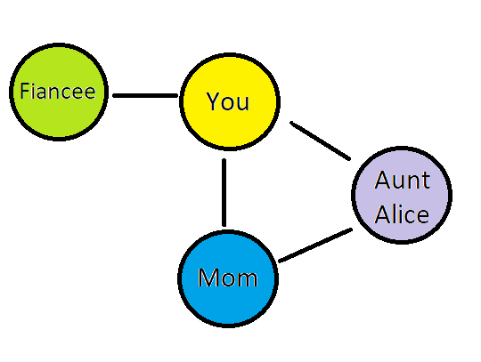

So far in this course, we’ve examined problems relating one variable to another variable (ie. correlation), relating one variable to many other variables (ie. predictive models with features), and finding common ground among a set of variables (ie. clustering).  But what do we do if we want to model a many-to-many relationship?

When the question of interest is relationships among many things, data scientists turn to network analysis.  This branch of data science, supported by the mathematics of graph theory, has its own special language and approach.  It is responsible for some [very cool visualizations](http://www.jeromecukier.net/projects/agot/places.html).

The goal of this module is to give you enough knowledge to be able to talk with others about basic network analysis concepts and enough experience to decide if you want to pursue networks further.  It’s a field that can be a lot of fun, especially if you are a visual person who likes to weave numbers and graphs together.

## What is network analysis?

You’re minding your own business one day when the phone rings.  It’s your Aunt Alice, who you haven’t talked to in years.  She immediately begins berating you for not inviting her to your upcoming wedding.  Half-deafened by the shouting, you nonetheless manage to pick out that your mom let the news slip when she and Alice were having their weekly sisterly chat.  
Somehow getting Alice off the phone without promising anything, you start an irate text to your mother.  Before you can hit send, however, a message from ‘The Momster’ arrives with a beep: “OMG AA on warpath so srry.”  Exasperated, you turn off your phone and head to the kitchen to rant to your fiancee.

Drama, drama, drama.  There’s clearly a lot of information being exchanged in this situation, but it’s hard to imagine how you would capture it using our traditional ‘columns of variables’ approach to data organization.  If we tried to summarize who was talking to whom, it might look something like this:

Characters:
You
Mom
Aunt Alice
Your fiancee

Paths of information exchange:
You - Mom
Mom - Aunt Alice
Aunt Alice - You
You - Your fiancee

To make it even clearer, we can draw it:

# Networks: Modeling Information Exchange

The pattern of information exchange we’ve described is called a _network_, and the mathematical representation of a network is called a _graph_.  Networks happen everywhere, from social networks like Twitter to networks modeling electrical activity in the brain or linking genes and diseases. The study of network-type data is called _graph theory_, a segment of mathematics that has been under development since the late 1700s, when Euler used graphs to address the [Bridges of Königsberg problem](https://en.wikipedia.org/wiki/Seven_Bridges_of_K%C3%B6nigsberg).

In this module we’ll introduce you to the language and tools used to model and extract information from networks.  As you might expect from nearly 300 years of math, there’s going to be a lot that we won’t be able to cover. Still, by the end you’ll have a sense of what network analysis can do and whether it is something you are interested in pursuing further.

## Paths

The value of network structures is that they can disseminate information incredibly quickly.  Information spreads from one point to all its neighbors, and from those points to all their neighbors, and so on.  The speed of information spread depends on the number of neighbors a point has, and the strength of the relationship between the points. 

Graphs are valuable because they reduce a complex set of network interrelationships into a simpler set of numbers that help us to pick out particularly important connections and influential points within the network, or areas where connections are missing.  Representing the network of social interactions at a workplace, for example, may help to identify bottlenecks where information is not being disseminated due to missing connections.

Let’s abstract the communications network described in our Aunt Alice situation into a graph, and see what we can learn.

In the world of graphs, the circles represent *nodes*, also called *vertices*.  The connections between nodes are called *links*, or *edges.*  The relationships between nodes and links can be expressed as an adjacency matrix *A, an *n* by *n* matrix with a row and column for each node.  If node *k* is linked to node *j*, then A{j,k}=1.

The adjacency matrix for the scenario pictured above would be:

|            | You | Aunt Alice | Mom | Fiancee |
|------------|-----|------------|-----|---------|
| You        | 0   | 1          | 1   | 1       |
| Aunt Alice | 1   | 0          | 1   | 0       |
| Mom        | 1   | 1          | 0   | 0       |
| Fiancee    | 1   | 0          | 0   | 0       |

## Traits of Links

### Direction

You may notice that the adjacency matrix is symmetrical: Values above the diagonal are the same as values below the diagonal, thus A{j,k}=A{k,j}.  This is because the links in the graph are undirected-they only indicate that a connection between two nodes exists.

A graph with directed links is called a *digraph* (a graph without directed links is just a graph).  Links in a digraph are visually represented with arrows that show the direction of the relationship.  ‘Direction’ generally refers to the flow of information.  For example, in our scenario, Aunt Alice yells at you, but you don’t respond-- information is flowing only one way, from her to you.  Similarly, later you go to complain about your family to your fiancee.  The fiancee’s response is not included, so information is once again flowing only one way, from you to her.  Other communication pathways, like the one between you and your mom, are bidirectional- information flows both ways.  

Visually, a digraph of that scenario looks like this:

[insert ‘directed_network_example.png’ from assets folder]

The Adjacency Matrix looks like this:

|            | You | Aunt Alice | Mom | Fiancee |
|------------|-----|------------|-----|---------|
| You        | 0   | 0         | 1   | 1       |
| Aunt Alice | 1   | 0          | 1   | 0       |
| Mom        | 1   | 1          | 0   | 0       |
| Fiancee    | 0   | 0          | 0   | 0       |

The adjacency matrix for a digraph is not symmetrical.  It is the convention that in an adjacency matrix cell, information flows from the node encoded by the row coordinate to the node encoded by the column coordinate. For example, $A{You,AuntAlice}=0 (‘You’ is the row and ‘Aunt Alice’ is the column), while $A{AuntAlice,You}=1 (‘Aunt Alice’ is the row and ‘You’ is the column).  

You may be looking at the *A* for the digraph and thinking that it is a pretty inefficient way to store information.  More than half of the cells are zero, meaning the digraph is *sparse*.  In fact, most real world networks are sparse.  Think of all the pages on the internet and how many of them any one page links to, or all the people at your workplace and how many of them you see on a daily basis.  As networks get larger, efficient encoding becomes important.  A more efficient way to encode a sparse graph is via node pairs.  In a directed graph, information is assumed to flow from the left-hand node of the pair to the right-hand node.  Nodes without a link are not included in the pair list.  The digraph representation of our scenario, in list form, is:

(You, Mom)
(You, Fiancee)
(Aunt Alice, You)
(Aunt Alice, Mom)
(Mom, You)
(Mom, Aunt Alice)

What we can see from this list of paths is that if anybody wants to get a message to Aunt Alice, they need to talk to Mom (she’s the only person with Aunt Alice on the right-hand side of a link, indicating information flows *from* Mom *to* Aunt Alice).

### Weight

Links can also carry information about the strength or type of relationship between vertices.  These are called *weights*.  For example, if Mom and Aunt Alice talk every week but You and Mom talk every day, then the link weight for {You, Mom} would be 7 and the link weight for {Mom, Aunt Alice} would be 1.  This might be conveyed visually through the thickness of the link lines, or through a number next to each link showing its weight.  Graphs where the links have weights are called *weighted graphs*.  Weighted links are expressed as triples: (You, Mom, 7).

## Walks, Paths and Cycles

A sequence of links connecting a sequence of nodes is called a walk or path.  Just as in real life, it is possible to traverse the same places (nodes and links) more than once during a walk.  In directed walks, all links must have the same direction.  For example, one directed walk from the graph above would be {Aunt Alice, You, Mom, Aunt Alice, Mom, You}.  That walk has length 6.

If all the nodes and links in a walk are different, it is called a *simple walk* or a *simple path*.  A simple path linking Aunt Alice to You would be {Aunt Alice, Mom, You}.  

If a simple path starts and ends at the same node, it is a *closed cycle*.  For example, a simple path from {Aunt Alice, You, Mom, Aunt Alice} would be a closed cycle.

Note that the language around walks and paths is a bit confused.  Some sources use ‘walk’ to refer to any alternating sequence of nodes and links, and ‘path’ to refer to a walk where no nodes or links are repeated.  Others use ‘path’ for the more general term and ‘simple path’ when referring to an instance with no repetitions.  For clarity, we will use ‘walk’ to refer to the more general case and ‘simple path’ for a walk with no repetitions.

A great deal of interest in graph theory comes from seeking algorithms that can identify all the *shortest* walks between all pairs of nodes in a graph-- the most efficient paths for information flow.  At present, the task is [computationally intensive and slow](https://en.wikipedia.org/wiki/Shortest_path_problem#All-pairs_shortest_paths), with little improvement on brute force (finding every possible walk in the graph and picking the shortest ones).  Companies like Google are naturally interested in finding a simple and fast way to calculate the shortest route between all possible pairs of points on a map, but we’re not there yet.

For unweighted graphs, the shortest path is the one with the least number of nodes and links.  For weighted graphs, however, the shortest path is the one with the lowest cumulative weight, calculated by adding together the weights of all the links that make up the path.  It may involve more links but those links have a lower total weight than a path with fewer links.  Note that this assumes that higher weights indicate distance or difference between nodes.  In cases where higher weights indicate greater similarity (say, if the link weights were correlations between variable-nodes) then you would take the inverse of each weight (1/weight) before trying to find the shortest path.

The value of a node depends on its position in the walks, paths, and cycles between other nodes.

## Nodes

Nodes are usually the focus of a network analysis, particularly identifying important or central nodes, called ‘hubs.’  Of course, importance and centrality can be defined in many ways:

## Degree

The *degree* of a node is the number of links connected to that node.  For directed graphs, each node has both in-degree (the number of links entering) and out-degree (the number of links leaving) that node.  For example, the in-degree of You is 2, while the in-degree of Aunt Alice is 1.  A node with a higher degree has more connections and therefore more possibilities for influence.

## Clustering

The ‘local clustering coefficient’ of a node describes the probability that any two nodes it is linked to will also be linked to each other.  The higher the clustering score, the more redundant the node.  For example, consider the airports at Denver and Chicago in the US.  Planes fly between these two cities all the time.  Both also serve as intermediate nodes on the paths that connect East Coast cities like New York, Boston, or Washington, D.C to West Coast cities like San Francisco or Las Vegas.   If the entire city of Denver were to be incapacitated by vengeful zombie ex-parrots, flights would still be able to get from New York to Vegas-- they would just go through Chicago.  And vice versa.  While there are some unique routes that are only served by one airport or the other, [there is a great deal of overlap](http://www.arcgis.com/apps/OnePane/storytelling_basic/index.html?appid=605204b677894f0da7a1acd83b9ee308&_ga=1.47316964.235754488.1426102017), or in other words, high clustering.  

Formally, the clustering coefficient for a node $i$ with $k$ links (degree $k_i$) can be calculated as:

$C_i=/frac{2L_i}{k_i(k_i-1)}$

Where $L_i$ is the number of links between the $k$ neighbors of node $i$.  $C_i$ ranges from 0 to 1 and indicates the probability that any two neighbors of node $i$ will be linked to one another.  

Another way to refer to clustering is *local density*.

Note that calculating the clustering coefficients for directed or weighted nodes is possible but [a bit more complicated](https://arxiv.org/pdf/1308.0971.pdf), with many proposed methods and no consensus on which is best.  (The preceding link is to a long and technical mathematical paper and is not by any means required reading.)

The clustering coefficients for the undirected graph of our Aunt Alice scenario are:
You: .5
Fiancee: NA (only connected to one node)
Mom: 1
Aunt Alice: 1

## Betweenness
**Betweenness centrality** is the measure of how many times a node is part of the shortest path between two other nodes.  One way to think about betweenness centrality is that if that node were removed, the spread of information throughout the network would become slower (because the shortest paths between some nodes would presumably become longer or cease to exist at all).

# Graph Properties

Graphs can be *connected* if there is a way to travel from any node to any other node, or *unconnected* if that isn’t the case.  A directed graph is *strongly connected* if there is a directed path linking every node to every other node.  The digraph we’ve been using is connected, but not strongly connected: there is no direct path from Fiancee to any of the other vertices.

There are a lot of other properties of graphs- you can check out a list of them [here](https://www.cl.cam.ac.uk/teaching/1011/PrincComm/slides-lpr/graph_theory_1-11.pdf).

# Is it a graph or a network?

In practice, the terms ‘graph’ and ‘network’ tend to be used interchangeably, as do their subterms: Graphs have vertices and edges, while networks have nodes and links.  Some distinguish between them by saying that networks encode real information (facebook friendships, neurons in the brain) while graphs are mathematical abstractions.  

As you’ve probably noticed, we use ‘node’ and ‘link’ throughout.  When we’re referring to the phenomenon under study, we’ll say ‘network,’ but when talking about the representation of the network that we perform math on, we’ll call it a ‘graph’.  So for example, your mom may be a central node in your social network, with links to many of your friends and family.  To calculate exactly how central your mom is, we would input your social network information into a graph, and our calculations would be based on that graph.  In the words of a common aphorism, the graph is the map, but the network is the territory.

# DRILL: Graph practice

Take the current undirected graph describing the Aunt Alice scenario and update it to reflect the following events:

As a result of Aunt Alice’s temper tantrum, she and your mother are no longer speaking to each other.  Aunt Alice, still angry, called your fiancee to complain-- shockingly, this has ended in the fiancee becoming good friends with Aunt Alice due to their shared love of cute cat photos.  Meanwhile, you’ve met two of your fiancee’s best friends, Dave and Brian, who are themselves good friends of long standing.

Calculate the degree of each node
Mom: 1
You: 4
Aunt Alice: 2
Fiancee: 4
Dave: 3
Brian: 3
Write a list of edges
{Mom, You}
{You, Aunt Alice}
{You, Fiancee}
{You, Dave}
{You, Brian}
{Fiancee, Dave
{Fiancee, Brian}
{Dave, Brian}
Calculate the clustering coefficient for each node:
You: 8/20
Mom: NA (only links to one node)
Aunt Alice: 1
Fiancee: 8/12
Dave: 1
Brian: 1
Calculate the shortest paths between each pair of nodes:
You,Fiancee: 1
You, Mom: 1
You, Aunt Alice: 1
You, Dave: 1
You, Brian: 1
Fiancee, Aunt Alice: 1
Fiancee, Mom: 2 (Fiancee, You, Mom)
Fiancee, Dave: 1
Fiancee, Brian: 1
Aunt Alice, Mom: 2 (Aunt Alice, You, Mom)
Aunt Alice, Dave: 2 (Aunt Alice, You, Dave) (Aunt Alice, Fiancee, Dave)
Aunt Alice, Brian: 2 (Aunt Alice, You, Brian) (Aunt Alice, Fiancee, Brian)
Mom, Dave: 2 (Mom, You, Dave)
Mom, Brian: 2 (Mom, You, Brian)
Dave, Brian: 1
Calculate the betweenness centrality of each node:
You: 6/12
Fiancee: 2/12
Mom: 0/12
Aunt Alice: 0/10
Dave: 0/11
Brian: 0/11
Find a walk of length 5 linking Fiancee to You
{Fiancee, Dave, Brian, Dave, You} or 
{Fiancee, You, Aunt Alice, Fiancee, You}
{Fiancee, Brian, Dave, Brian, You}
{Fiancee, Brian, You, Aunt Alice, You}
etc
Find the shortest path linking Dave to Mom.
{Dave, You, Mom}
How long is a cycle linking You to Aunt Alice?
3 {You, Fiancee, Aunt Alice, You}

