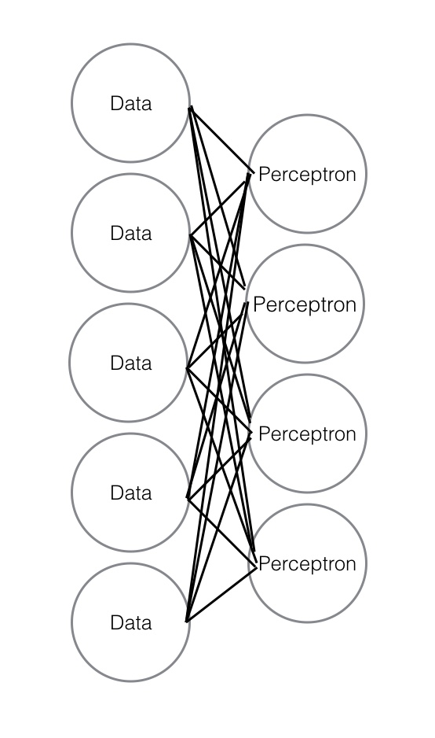

Now that you've seen _supervised_ neural networks, the time has come to discuss the _unsupervised_ version. Unsupervised neural networks were largely responsible for the burst in neural network research that happened around the mid 2000's. Instead of predicting a labeled value, these algorithms use a neural network structure like we discussed in the previous lesson to perform a variety of different tasks. We'll talk about some of them below.

## Feature extraction

_Feature extraction_ involves taking a dataset with information in a form unfriendly to predictive modeling and translating it into a form that is more friendly. Like dimensionality reduction with PCA, where we have so much data or so many features that we need to reduce the number of dimensions in order to have a performant model, feature extraction involves translating data from one set of features to a new set of _different_ features. This new set of features is often smaller and more suitable for further processing than the original data.

For example, in image recognition this can mean something like taking a series of pixels and translating them into things like lines, edges, or certain kinds of curves. These features are _present_ in the original data, but can be difficult to manually discover because of high dimensionality or because of the structure of your data.

Feature extraction can also be contrasted with feature _engineering_: the manually driven process you're familiar with where you add new features to the existing data set.

The features extracted via this kind of algorithm are often then fed into _another_ model that uses them for some kind of predictive task. This process is often referred to as a _modeling pipeline_.

## Restricted Boltzmann machines

[Restricted Boltzmann Machines](https://en.wikipedia.org/wiki/Restricted_Boltzmann_machine), or RBM, are a common form of neural network. These networks look a lot like the single layer perceptrons we showed previously but without the specified output to train on. That means they really work in two layers. On the first layer is the inputs, or visible nodes. The second layer is the hidden layer, which is the new set of derived features. The wiki page linked above goes into some of the math, but the key to understand is that these networks aim to extract patterns through finding reasonably common aggregations within the data.

## Autoencoders

Autoencoders are another variety of neural network that is used for unsupervised learning. These models have an additional layer of output compared to RBMs. Another distinguishing feature of autoencoders is that they are often defined by the number of features they output. An autoencoder can have the same number of output features as input features, in which case it is being used to better learn those features. It can also have fewer output features, whereby it is compressing the original data. Finally it could have more output features, as a method of expanding the data.

Very frequently, autoencoders will have the _same_ number of output features as input features, while translating through a hidden layer with fewer features. How can this be valuable? Well, its because of the unique purpose of an autoencoder itself. Rather than try to extract features from the data set or reduce dimensionality, an autoencoder is designed to regenerate features, improving their robustness and grouping together redundancies in the process. That's why a dataset with five features that goes into an autoencoder can come out with five features but be in a better state for modeling.

Here's a diagram of an autoencoder like that which starts with five input features, encodes into four features, and then decodes _back_ into five features:

Autoencoders are often used early in the modeling pipeline for pre-training neural networks. This is the process of taking the hidden middle layer generated by the autoencoder and using it as input for another neural network layer.

## Examples in unsupervised neural networks

Running these kinds of neural networks generally happens in specific contexts, the most common of which is image recognition. RBM in particular is a valuable way to work with image data. However we've yet to cover image recognition, and there is often significant processing that goes into that (we'll cover *scikit-image*, a companion package to scikit-learn, later in the specializations). As such, we're not going to run these models here. You can look over SKLearn's [RBM example](http://scikit-learn.org/stable/auto_examples/neural_networks/plot_rbm_logistic_classification.html#sphx-glr-auto-examples-neural-networks-plot-rbm-logistic-classification-py) if you want to see how it can work with digit recognition and discuss with your mentor if there are any steps you don't understand. RBM is the only unsupervised neural network in SKLearn.

