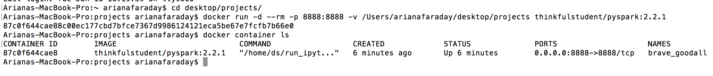
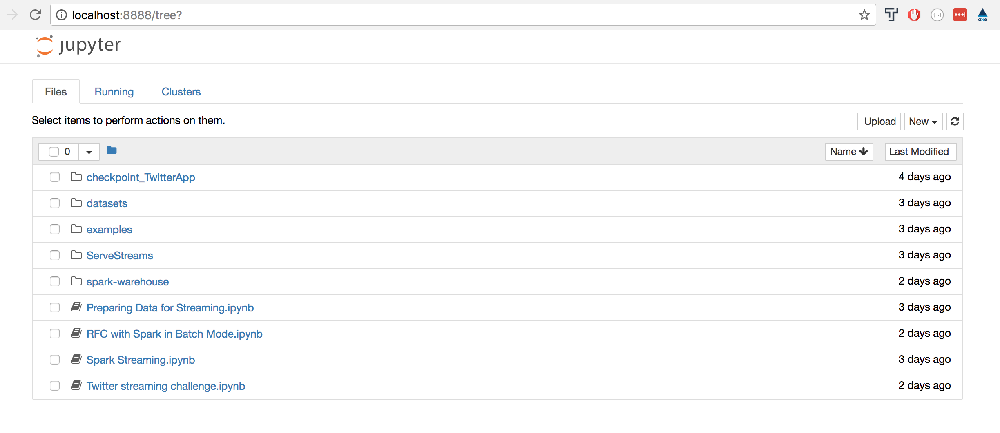

In this reading, you'll get up and running with Docker, which is the environment you'll run Spark in to do big data work in the remainder of this lesson. Docker lets you define and boot up  *containers* that provide a standard computing environment, regardless of the details of the machine (for instance, Linux vs. Mac vs. Windows) the container is running on. You'll sign up for docker and get it running locally, and then you'll clone and run a Thinkful-authored container with a basic Spark environment.

## Why should data scientists care about Docker?

By this point in the course, you very likely have encountered situations where managing multiple Python packages and dependencies becomes challenging — sometimes it feels like you spend more time configuring systems than doing actual data science. This is but one of several problems that Docker solves.

Docker containers also allow for ease of reproducibility. A Docker container can be run on any environment that supports Docker, meaning that behavior under a Windows, Mac, or Linux host will be identical. This is a huge benefit for teams that share code and analysis.

Docker containers can also help in prototyping solutions. They can be run on anything from a local laptop to extra large Amazon Elastic Compute Cloud (Amazon EC2) instances. Data scientists can leverage this functionality to test code in small pieces locally, then deploy the container to a powerful server in the cloud when production-level performance is necessary.

## Okay, but why NOW in a Spark lesson?

Apache Spark can be challenging to install and configure — it is inherently a cloud-based server designed for multi-tenancy. In other words, an instance of Apache Spark can be installed on multiple computers that act as a single cluster. When set up as a cluster, it leverages the combined power of all systems in the cluster by distributing data and computations across the various systems.

Configuring and managing a cluster isn’t the easiest task, though, especially for newcomers to Apache Spark. We could avoid some of this by running Spark locally in a single instance configuration, but you'd still have to install and configure Java and any Spark bindings for Scala, Python, or R.

Fortunately, we can avoid all of these configuration headaches by using a Docker container set up with our required dependencies and setup. Instead of spending time and energy on the installation, we can quickly get up and running with the important business of learning Spark.

## Containers and images and Dockerfiles! Oh, my!

Before installing Docker, there are 3 key terms we need to define:

- **Image:** An image is a built blueprint that contains everything needed to run a Docker container. They typically extend upon a base image (sometimes a vanilla OS, sometimes a base OS with additional software already installed).
- **Container:** A container is an instantiation of a Docker image - the running virtual machine that you will interact with when you’re performing data science tasks.
- **Dockerfile:** A set of instructions that are run sequentially and together provide the definition of a specific image. Dockerfiles contain commands that instruct Docker how and what to build. These are variations on typical Unix commands and settings.

There are a few ways to access Docker images. You can find several repositories (containing Dockerfiles and any auxiliary dependencies or helper scripts) on GitHub. If you fork or clone them locally, you can build the image and run the container locally. Using Docker this way is a little more involved but allows for better customization of your images.

If you don’t need further customization, you can also access images through Docker Hub, which is what we'll do in this lesson. In this scenario, Docker will check [https://hub.docker.com](https://hub.docker.com) for the image you specify in the `docker run` command. With a single command, you can have something as complex as a Spark deployment running locally in minutes (or seconds, if you have a blazing fast Internet connection).


## Installing Docker locally

Let's get Docker running locally.

1. **Create an ID on Docker Hub**: [Sign up for an ID at Docker Hub](https://hub.docker.com). This will allow you to push your own images, which makes deployment easier when you start using Docker in other environments. You can also star other public images for future reference. 
1. **Install Docker**: Docker runs as a system service in a host operating system. 
	* If you're on a Mac, or using Windows 10 Pro/Enterprise, you’ll use the Docker Community Edition. [Download the right install package for your system](https://www.docker.com/community-edition) and execute the installer. Once installed, Docker runs in the background and is accessible from the command line. You can also manage some settings and see local running status from the menu bar.
	* If you're using Windows 10 Home or an earlier version, you'll use the Docker Toolbox. [Download the toolbox](https://docs.docker.com/toolbox/overview/) and execute the installer. Docker provides [comprehensive documentation](https://docs.docker.com/toolbox/toolbox_install_windows/#step-1-check-your-version) to help you get set up. Once Docker is installed, you'll use the Docker QuickStart Terminal for the remainder of this lesson.

While not necessary for this lesson, at some point you'll also want to spend some time reading up on how Docker works. [Docker's official tutorial](https://docs.docker.com/get-started/) is a great place to start.

## Running Spark via Docker

For the remainder of this lesson, you'll run Spark from a local Docker-based instance. This will allow you to learn how Spark works without the overhead of installing a multi-tenant configuration. To do this, you'll pull down a Thinkful-authored, prebuilt image directly from Docker Hub. Let's get to it!

For this assignment and the other guided walkthroughs in this lesson, you'll start out here in the curriculum app to get some background information, then you'll run a docker container locally, serving Jupyter notebooks from [this GitHub repo](https://github.com/Thinkful-Ed/big-data-student-resources). These notebooks contain working code that you can see in action by connecting to your locally hosted Apache Spark server. This approach will allow you to focus on the details of developing machine learning solutions with Spark.

Here's what to do:

1. Head over to GitHub and fork the [big data student resources repository](https://github.com/Thinkful-Ed/big-data-student-resources) to your account.
1. Clone your new repo to your local environment using `git clone`. Make a note of the path you've cloned the repo to because you'll need it again soon.
1. Before doing anything else, make sure you don't have any previous Jupyter Notebooks running on port 8888 (the default port Notebooks run on). We'll make the Jupyter Notebook instance served by our Docker container available on that port.
1. From the command line, enter the following command (be sure to replace `/path/to/big-data-student-resources` with the correct local path to the repo you just cloned):

    ```
    docker run -d --rm -p 8888:8888 -v /path/to/big-data-student-resources:/home/ds/notebooks thinkfulstudent/pyspark:2.2.1
    ```

    Let's unpack this command. It tells Docker to run a container called `thinkfulstudent/pyspark:2.2.1`. Docker will first check to see if this container is available locally. If so, it will run the container. If not, it will try to download it from Docker Hub, which is what will happen this time around. Unless you have insanely fast Internet, this will take a few minutes.

    Once the container is available locally, Docker will run it. Let's break down the command line arguments we have here:

    - `-d`: This tells the container to run as a single process in the background.
    - `--rm`: This tells Docker to remove the container (note, **not** the underlying image) after we shut it down.
    - `-p 8888:8888`: This defines the port mapping from the container to the host. Our container exposes port 8888, and this is the right-side of the colon in the command. The left side (in this case also 8888) indicates the host device port that is associated with the exposed container port.
    - `-v /path/to/big-data-student-resources:/home/ds/notebooks`: This command maps a local folder to a corresponding directory inside the container and allows us to save files and data our container needs even after it's done running. The left side of the colon (`/path/to/big-data-student-resources` — if you're following along, provide a valid path for your own computer!) contains a fully qualified path on the host machine. The right side (`:/home/ds/notebooks`) defines a corresponding directory inside the container where the code or data will be mapped.
    - The final argument (`thinkfulstudent/pyspark:2.2.1`) tells Docker the image you wish to run. As we already stated, Docker first looks for the image locally, and if it doesn’t find it, goes to Docker Hub and attempts to pull it down and run it.
1. After the container starts running, you should see the ID of the new container printed to the command line. 
1. Try running the command `docker container ls` to get info about any currently running containers.
    
    

1. In your browser, go to `localhost:8888`. You should see the standard Jupyter home screen. If your notebooks directory mapped properly, it will be populated with the notebooks in that directory when you launch, as shown below.

    


1. Next, let's create a new notebook and try out the Spark installation. Create a new notebook and then run a cell with the following commands:

    ```python
    import pyspark

    sc = pyspark.SparkContext('local[*]')
    rdd = sc.parallelize(range(1000))
    rdd.takeSample(False, 5)
    ```

    If everything works properly, you’ll see an output of 5 random numbers after the `rdd.takeSample(False, 5)` line runs.

1. After you’re finished working, you may want to stop the container. This is easily accomplished through the `docker stop` command plus either the container ID or the container name. You can find both the ID and the name by running the same `docker container ls` command that we used above. In the example of the container we launched earlier, we could type: `docker stop 87c0f644cae8` or `docker stop brave_goodall` to shut down and remove the running container.


Congrats! You've successfully installed Docker, and run and stopped your first container.


