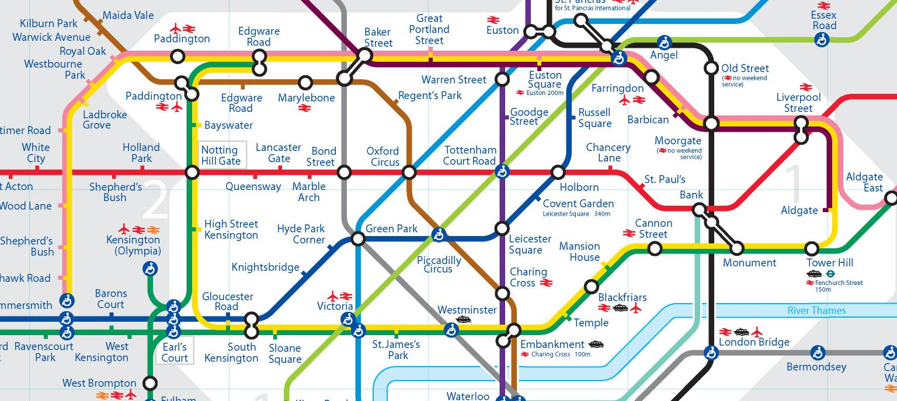

Statistical models are ubiquitous.  We rely on statistical models (or just "models") every time we [check the weather report](https://www.weather.gov/mdl/StatisticalModeling_home), [choose a movie recommended by Netflix]( https://www.theatlantic.com/technology/archive/2014/01/how-netflix-reverse-engineered-hollywood/282679/), or [get excited about our favorite presidential candidate's electoral potential](https://fivethirtyeight.com/features/a-users-guide-to-fivethirtyeights-2016-general-election-forecast/).

For that matter, if you've ever navigated public transit, you've worked with a model. The most famous public transit map in the world is the London Underground Tube map:

This map represents all the train lines in the London Underground (or "the Tube") in terms of their stops and intersections with one another.  It's a simplified representation of the real train lines. For example, it does not include any information on the relative distances between the stops or the actual geographical position of the lines.  When it was first proposed, this model of the London Underground was revolutionary: it excludes information that is irrelevant to the needs of Tube travelers and by doing so, becomes much easier to use.

To see some of the excluded information check out this [animation that morphs between a geographical representation of the Tube lines and the modern Tube map](http://www.fourthway.co.uk/realunderground/).  Which would you rather use to navigate the Underground?

Statistical models operate in the same way: they represent complex information in a simplified way to serve a particular goal.  To be more exact, a **statistical model** is:

>a _simplified mathematical representation of the data scientist's best guess about the underlying processes that created the data_.

That definition has a lot of moving parts. Let's break it down. 

### "Simplified"

When creating a model, the data scientist prioritizes information-dense features: elements that explain a large amount of variance in the outcome of interest.  By excluding less informative features, the model does not perfectly represent the data, but its simplified form is easier to understand and work with.  After all, reality is too complex to be perfectly modeled.

For the London Tube Map, the goal was to guide travelers through the system.  The position of each stop on a line, and the intersection of lines, are information-dense features for travelers.  The relative time between adjacent stops, on the other hand, is less relevant, and is thus excluded from the map.

### "Mathematical representation"

A statistical model is a mathematical formula or series of formulas.  It can also be represented using words or programming statements, but these are just glosses on the math.

(Here the London Tube Map isn't a great example. As it's a conceptual model rather than a mathematical one, it is represented visually rather than mathematically.)

### "Data scientist's best guess"

Generally speaking, the model we propose and test represents our best understanding of the data at that time – our best guess about the underlying processes that led to the outcomes we observe. The model design is informed by prior knowledge about the topic area, visual inspection of the data, and the outcomes of fitting previous models to the data.

The London Tube Map has actually been improved several times since its original version ([available here](http://www.fourthway.co.uk/realunderground/)) as its designers learned more about how people processed and understood the information on the map.

### "Underlying processes"

A good model gives some insight into how your variable of interest came to have the values that it does.  This aspect of modeling is particularly useful when we are interested in predicting future outcomes.  If we have a reasonable approximation of the underlying processes that created the outcomes we have in the data, we can use the model to predict how those underlying processes would respond to new data and what outcomes would result.

By showing all the Tube lines and how they intersect, the London Tube Map not only shows travelers where they need to go, but gives them a general idea of what will happen to get them there.  Imagine a subway navigation system without any underlying process information: you would give your starting point and destination and be given a list of stops and exchanges to use with no context about where they are in relation to each other.

It is the goal of every data scientist to create statistical models that are as efficient and useful as the London Tube Map!  With the help of a good statistical model, even a non-statistician can understand a complex dataset.  A statistical model can be beautiful: by paring away the non-essential aspects of a dataset, we get a tiny glimpse into the workings of the universe.

## Models and math

Statistical models are based on a mathematical formula (or set of formulas), so theoretically any set of relationships among variables that can be represented using math can be used as a model.  In reality, however, data scientists tend to choose from a set of models whose mathematical properties are well understood.  Because of hard work by theoretical statisticians, mathematicians, and data scientists, we know a lot about how certain types of models behave under various conditions and with various data.  

Some models work really well with continuous data, while others are designed for categorical data.  Some models will only allow two variables (like the t-test, with a categorical predictor and a continuous outcome), while others allow as many as we want.  In the rest of this Unit, we'll discover what sort of model is best for the data you have and the question you want to answer.

